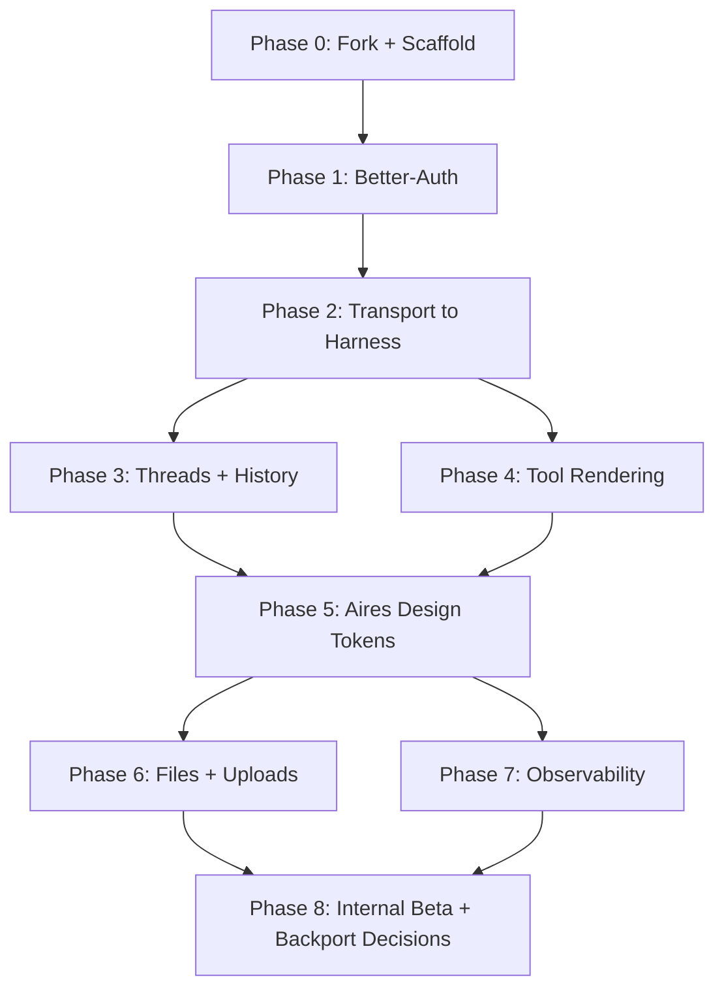

# apps/chat-vercel — Fork of vercel/chatbot wired to Aires Headless CRM

> A second, richer chat client built by forking [vercel/chatbot](https://github.com/vercel/chatbot) and swapping its auth, transport, and persistence layers for the Aires Headless CRM. Shares `apps/agent-harness` and `apps/core` with `apps/chat-web`. Internal beta is how we decide which Vercel UX wins to backport to our basic client.

---

## Why two clients

| Question | apps/chat-web | apps/chat-vercel |
|---|---|---|
| Who owns it? | Us, end to end | Us, but started from Vercel's template |
| Primary goal | Minimum surface that tests the harness fast | Benchmark the "best-in-class" UX |
| Ships first? | Yes (Phase 1 of overall plan) | After chat-web is testable |
| Risk if Vercel changes template? | Zero | Manageable — we own the fork |
| Design ownership | Aires tokens from day 1 | Port tokens in Phase 5 |

Both clients talk to the **same** `apps/agent-harness` UI-message-stream endpoint and the **same** `apps/core` thread + auth endpoints. No divergence in backend contracts.

---

## State Machine



Phase 0 unblocks everything. Phases 1 and 2 must land before anything else renders. Phases 3 and 4 can proceed in parallel. Phase 5 is the earliest point the client looks like an Aires product. Phase 8 is where we decide whether chat-web absorbs parts of the fork or stays lean.

---

## Phase Status Tracker

| Phase | Name | Status | Notes |
|---|---|---|---|
| 0 | Fork + Scaffold | pending | Vendor with `rsync --exclude .git`; keep Vercel attribution in NOTICE |
| 1 | Better-Auth | pending | Reuses `@acme/auth` already used by chat-web |
| 2 | Transport to Harness | pending | Same `/api/chat` proxy pattern as chat-web |
| 3 | Threads + History | pending | Reuses core `/api/v1/chat-threads` and harness `/v1/threads/:id/messages` |
| 4 | Tool Rendering | pending | Evaluate Vercel's tool UI; may backport to chat-web |
| 5 | Aires Design Tokens | pending | Port `@acme/ui` theme; keep Vercel layout/chrome |
| 6 | Files + Uploads | pending | Route through core signed-URL endpoint |
| 7 | Observability | pending | `@acme/observability`; request IDs end-to-end |
| 8 | Internal Beta | pending | Railway deploy; collect backport decisions |

---

## Decision matrix — what to keep, swap, remove, defer

Derived from a scan of [vercel/chatbot](https://github.com/vercel/chatbot) at the time of this plan. Four buckets:

- **keep-vercel** — use as-is from the template
- **swap-to-aires** — replace with our existing Aires plumbing
- **remove** — not aligned with single-tenant CRM direction
- **defer** — interesting but post-beta

### Authentication & session

| Item | Decision | Rationale |
|---|---|---|
| NextAuth (GitHub OAuth demo) | **swap-to-aires** | We already use Better-Auth via `@acme/auth`. Consistent with chat-web, core, and the MCP auth story. |
| Guest mode | **keep-vercel**, gated by flag | Nice for demos; gate behind `CHATVC_ALLOW_GUEST` env flag so it's off in prod. |
| Session persistence | **swap-to-aires** | Use Better-Auth cookies; same middleware as chat-web. |
| Rate limiting | **swap-to-aires** | `@acme/ratelimit` / Redis shared with the harness. |

### Transport & streaming

| Item | Decision | Rationale |
|---|---|---|
| Direct `streamText()` in a server action | **remove** | All model calls go through `apps/agent-harness`. Client never sees provider keys. |
| `useChat` with `DefaultChatTransport` | **keep-vercel** | Already works with UI message stream; same as chat-web. |
| `toUIMessageStreamResponse()` on the server | **swap-to-aires** | Server route becomes a thin proxy to `/v1/runs`. |
| Provider switching in the UI | **remove (client)**, **keep-server** | Route to harness; provider picking stays server-side via `AGENT_DEFAULT_MODEL` + override flag. |

### Persistence

| Item | Decision | Rationale |
|---|---|---|
| Drizzle schema for chat + artifacts + votes (Vercel Postgres) | **swap-to-aires** | We already have `chat_thread` in `@acme/db` + Redis ring buffer in `apps/agent-harness`. No second source of truth. |
| Migrations via drizzle-kit | **remove (from this app)** | Migrations live in `packages/db`. chat-vercel only reads/writes via core + harness APIs. |
| Redis for stream resume tokens | **swap-to-aires** | `@acme/kv`'s Redis instance. |

### UI surfaces

| Item | Decision | Rationale |
|---|---|---|
| Sidebar with thread list | **keep-vercel** | Richer than our `ThreadRail`; replaces it 1:1 once wired to our proxy. |
| Multimodal composer (text + attachments) | **keep-vercel** | Well-tested UX. Needs file pipeline (Phase 6). |
| Markdown renderer | **swap-to-aires** | Reuse our `Markdown` component + sanitizer; one implementation across clients. |
| Code block copy + language chips | **keep-vercel** | Nicer than our baseline. |
| Tool call rendering | **keep-vercel, reconcile with ToolCallCard** | Vercel's component is more complete; may become the canonical version and chat-web adopts it. |
| Artifacts (canvas/code/text/image editors) | **keep-vercel** | Killer feature; no equivalent in chat-web. |
| Suggested actions | **keep-vercel** | Reduces empty-state friction. |
| Voting + feedback | **defer** | Phase 8 telemetry hook instead; evaluate after beta. |
| Message branching / "regenerate" UI | **keep-vercel** | We already expose `regenerate()` from `useChat`. |
| Chat export | **defer** | Nice to have; not launch-blocking. |

### Integrations

| Item | Decision | Rationale |
|---|---|---|
| Vercel Blob for uploads | **swap-to-aires** | Route through `apps/core` signed-URL endpoint. |
| Vercel Analytics + Speed Insights | **keep-vercel** (optional) | Gate behind env flag; don't depend on it. |
| Playwright e2e suite | **keep-vercel** | Port to our `playwright` config; reuse scenarios. |
| Vitest | **swap-to-aires** | Convert to `tsx --test` to match the rest of the monorepo. |
| Biome | **swap-to-aires** | Use our `@acme/eslint-config` + Prettier; one linter across the repo. |
| OpenTelemetry | **keep-vercel**, wired to `@acme/observability` | Consistent tracing across chat-vercel → harness → core. |

### Config

| Item | Decision | Rationale |
|---|---|---|
| `.env.example` | **swap-to-aires** | Only `AGENT_HARNESS_URL`, `CORE_INTERNAL_URL`, `BETTER_AUTH_SECRET`, `BETTER_AUTH_URL`, `SINGLE_ORG_ID`. No provider keys. |
| `next.config.ts` | **keep-vercel**, prune | Keep turbo + image patterns; remove Vercel-specific plugins we don't use. |
| `middleware.ts` | **swap-to-aires** | Use `@acme/auth` session check; identical spirit, different provider. |

---

## Quality & Principles Considerations

| Principle | Plan |
|---|---|
| DRY | Share `@acme/auth`, `@acme/db`, `@acme/kv`, `@acme/observability`, `@acme/ui` across chat-web and chat-vercel — no duplicate auth/persistence layers. |
| Single Responsibility | chat-vercel owns UI only. All model calls, thread persistence, and tool execution live in `apps/agent-harness` and `apps/core`. |
| Error Handling | Every `/api/chat/*` proxy wraps fetch in try/catch, forwards request IDs, and surfaces a user-visible error banner on non-2xx. |
| Testability | Pure helpers (transport payload builder, tool-call state derivation, markdown renderer) live in `src/lib/*` and get `tsx --test` unit tests. Playwright e2e hits the real harness in preview envs. |
| Security | No provider keys in the client bundle. All outbound traffic is authenticated via Better-Auth cookie or short-lived agent JWT. CSP locked down; uploads signed via core. |
| Performance | Stream-first; code-split artifacts; `React.memo` on message rows; persist open thread id in `sessionStorage` to avoid re-render storms. |
| Modularity | No file over 500 lines. Artifact editors live in their own sub-module; each decision-matrix row maps to one file or folder. |

---

## Phase details

### Phase 0 — Fork + Scaffold

**Goal:** land `apps/chat-vercel` in the monorepo, building and booting locally against placeholder env values, zero Aires wiring yet.

**Tasks:**
- `rsync -a --exclude='.git' --exclude='node_modules' vercel/chatbot/ apps/chat-vercel/`
- Add `NOTICE.md` citing the upstream fork (commit SHA) and license.
- Rename package to `@acme/chat-vercel`, set `"private": true`, align `engines` + `packageManager` with the monorepo.
- Replace Biome config with `@acme/eslint-config` + Prettier.
- Replace Vitest with `tsx --test` scripts; migrate existing unit tests incrementally.
- Port `tsconfig.json` to extend `@acme/tsconfig`.
- Add `next.config.ts` + port `turbo.json` pipeline entries.
- Move the default port to 4002 (chat-web is on 4001) to allow side-by-side dev.
- Remove Vercel Postgres / Drizzle config from this app — no local migrations.
- Wire `pnpm -F @acme/chat-vercel dev / build / start / test / lint / typecheck`.

**Copy-paste prompt (Phase 0):**

```
Fork vercel/chatbot into apps/chat-vercel inside the aires-turbo monorepo. Keep
Vercel's UI/UX intact but replace its tooling with ours: pnpm workspace, turbo
pipeline, @acme/eslint-config, @acme/tsconfig, tsx --test instead of vitest,
ESLint instead of Biome. Drop Vercel Postgres + drizzle-kit config from this
app (migrations live in packages/db). Set the dev port to 4002. Do not wire
auth or chat transport yet — placeholders that compile are fine. Ship NOTICE.md
citing the upstream commit SHA and the Apache-2.0 license.
```

**Definition of done:** `pnpm -F @acme/chat-vercel build && pnpm -F @acme/chat-vercel dev` boots; visiting `/` renders the Vercel UI with a "Not wired yet" banner.

---

### Phase 1 — Better-Auth

**Goal:** identical auth story to `apps/chat-web`. One cookie, one middleware, same `@acme/auth` import.

**Tasks:**
- Delete NextAuth config, adapters, and callbacks.
- Import Better-Auth from `@acme/auth`; add `/api/auth/[...all]/route.ts` matching chat-web.
- Port login/signup UI to match chat-web's `/login` page (shared components from `@acme/ui`).
- Add `middleware.ts` that protects all routes except `/login` and `/api/auth`.
- Gate guest mode behind `CHATVC_ALLOW_GUEST=true`.
- Update `.env.example` to reference `BETTER_AUTH_SECRET`, `BETTER_AUTH_URL`, `SINGLE_ORG_ID`.

**Copy-paste prompt (Phase 1):**

```
In apps/chat-vercel, replace NextAuth with Better-Auth via @acme/auth. Mirror
the chat-web wiring: /api/auth/[...all]/route.ts, middleware.ts protecting
everything except /login and /api/auth, login page using @acme/ui. Keep a
guest-mode path gated by CHATVC_ALLOW_GUEST. No provider-specific OAuth
adapters. Produce a working sign-in flow against the same Better-Auth instance
chat-web uses.
```

**Definition of done:** signed-in cookie from chat-web works in chat-vercel on the same dev host; signing out in one logs you out of both.

---

### Phase 2 — Transport to Harness

**Goal:** every message streams from `apps/agent-harness` via a thin proxy, no direct AI SDK provider calls in this app.

**Tasks:**
- Delete `lib/ai/*` provider wiring.
- Add `/api/chat/route.ts` that forwards to `AGENT_HARNESS_URL + /v1/runs`, preserving cookies and `x-organization-id`.
- Configure `useChat` with `DefaultChatTransport` pointing at `/api/chat`; reuse `prepareSendMessagesRequest` to extract the last user message, exactly like chat-web.
- Delete model-picker UI; route picks provider server-side via `AGENT_DEFAULT_MODEL`.
- Remove `AI_GATEWAY_API_KEY`, `OPENAI_API_KEY`, etc. from env schema.

**Copy-paste prompt (Phase 2):**

```
In apps/chat-vercel, delete all direct AI SDK provider calls. Add
/api/chat/route.ts that proxies to AGENT_HARNESS_URL/v1/runs, forwarding the
Better-Auth session cookie and x-organization-id. Configure useChat with
DefaultChatTransport + prepareSendMessagesRequest that extracts the last user
message and passes { message, agentId, threadId } to the harness — identical
payload shape to apps/chat-web. Delete the model-picker UI. Remove provider
API keys from the env schema.
```

**Definition of done:** sending a message streams a real UI-message-stream response through the harness; the browser bundle contains zero provider keys.

---

### Phase 3 — Threads + History

**Goal:** chat-vercel reads and writes threads through the same core + harness endpoints as chat-web.

**Tasks:**
- Delete Vercel's Drizzle `Chat`, `Message`, `Vote`, `Document`, `Suggestion`, `Stream` tables.
- Replace the sidebar's query with `GET /api/chat/threads` (proxy → core).
- Replace the thread view with `GET /api/chat/history?threadId=...` (proxy → harness Redis history).
- Use `hydrateThreadMessages` from `apps/chat-web` as a reference; consider extracting it to a shared package if chat-vercel needs the same transform (likely yes — move to `@acme/chat-ui`).
- Add `PUT /api/v1/chat-threads/:id` call on first user turn to upsert thread title (done server-side by the harness already — just confirm it works).

**Copy-paste prompt (Phase 3):**

```
In apps/chat-vercel, rip the local Drizzle chat schema. Replace the sidebar
list with a proxy that calls core's /api/v1/chat-threads. Replace message
history with a proxy that calls the harness /v1/threads/:id/messages endpoint.
Reuse the persistedToUIMessages transform (extract to @acme/chat-ui if needed,
otherwise duplicate and plan to dedupe). First-turn thread title is upserted
by the harness — verify in network logs.
```

**Definition of done:** a thread created in chat-web shows up in chat-vercel's sidebar and vice versa.

---

### Phase 4 — Tool rendering

**Goal:** tool calls render inline with running / ok / error states, reusing the best of both clients.

**Tasks:**
- Compare `apps/chat-web/src/components/tool-call-card.tsx` against Vercel's tool UI.
- Pick the canonical version; if Vercel's is better, extract to `@acme/chat-ui/ToolCallCard` and backport to chat-web.
- Ensure `deriveToolCallState` handles every AI SDK v5 state: `input-streaming`, `input-available`, `output-available`, `output-error`, `aborted`.
- Add a "Copy tool args" + "Copy tool output" affordance.

**Copy-paste prompt (Phase 4):**

```
In apps/chat-vercel, decide whether our ToolCallCard or Vercel's tool-call
renderer is canonical. Extract the winner to @acme/chat-ui. Adapt it to render
AI SDK v5 message parts: tool-input-streaming, tool-input-available,
tool-output-available, tool-output-error. Add copy buttons for args and
output. If we replace chat-web's, land the swap in the same PR.
```

**Definition of done:** every tool call renders with status + collapsible args + collapsible output in both clients, using one implementation.

---

### Phase 5 — Aires design tokens

**Goal:** chat-vercel looks like an Aires product. Keep Vercel's layout structure, swap colors/type/components to our tokens.

**Tasks:**
- Import `@acme/ui` theme + Tailwind preset.
- Replace Vercel's `shadcn/ui` component instances with `@acme/ui` wrappers.
- Port typography + spacing scale from `@acme/ui/tokens`.
- Keep artifact/sidebar/composer layouts intact — just restyle.
- Run `apps/chat-vercel` alongside `apps/chat-web` and `Aires-Intelligence/figma MCP html/*` to visually compare.

**Copy-paste prompt (Phase 5):**

```
In apps/chat-vercel, replace shadcn/ui primitives with @acme/ui. Keep Vercel's
layout structure (sidebar + main + artifact panel). Swap colors, typography,
radii, spacing to Aires tokens. Do not change component structure unless a
primitive is missing from @acme/ui (in which case add it to @acme/ui, not
here). Ship before/after screenshots.
```

**Definition of done:** pixel-diff against a chat-web screen shows consistent tokens; designers sign off.

---

### Phase 6 — Files + uploads

**Goal:** file attachments route through `apps/core`'s signed-URL endpoint, not Vercel Blob.

**Tasks:**
- Add `POST /api/v1/files/uploads` in `apps/core` that returns a pre-signed S3/R2 URL (or a local stub in dev).
- Add `/api/upload/route.ts` in chat-vercel that proxies to that endpoint.
- Update the composer to POST to the signed URL directly from the browser.
- Persist the resulting file id on the user message as an AI SDK v5 file part.
- Remove `@vercel/blob` from dependencies.

**Copy-paste prompt (Phase 6):**

```
In apps/core, add POST /api/v1/files/uploads returning a pre-signed URL.
In apps/chat-vercel, remove @vercel/blob. Add /api/upload/route.ts that
proxies to core. The composer does a two-step upload: (1) call our proxy to
get a signed URL, (2) PUT the file directly. Attach the resulting file id on
the user UIMessage as a file part. Enforce a 25MB per-file cap server-side.
```

**Definition of done:** a user can attach an image + PDF, both round-trip through core, and the harness sees file parts on the inbound message.

---

### Phase 7 — Observability

**Goal:** single trace from browser click → agent turn → tool call → response.

**Tasks:**
- Wire `@acme/observability` in all `/api/*` routes; propagate request IDs via `x-request-id` header.
- Add OpenTelemetry trace correlation to every fetch out of chat-vercel.
- Surface the current `requestId` in a dev-only footer for easier bug reports.
- Redact PII in client logs.

**Copy-paste prompt (Phase 7):**

```
In apps/chat-vercel, wire @acme/observability. Every /api/* route logs a
structured event with traceId, userId, threadId, duration, and status.
Propagate x-request-id outbound to the harness. Add a dev-only footer that
shows the current request id and copies it to clipboard on click.
```

**Definition of done:** a single trace spans chat-vercel → harness → core → Redis for one chat turn.

---

### Phase 8 — Internal beta + backport decisions

**Goal:** deploy to Railway, run side-by-side with chat-web, decide what to merge back.

**Tasks:**
- Add Railway service for `apps/chat-vercel` (same pattern as the other apps).
- Create an internal landing at `chat.aires.internal/vercel` for beta testers.
- Run a 1-week internal trial with a feedback form.
- Decide, per row in the decision matrix, whether chat-web should absorb the Vercel win.
- If yes, open a chat-web PR per adoption.

**Copy-paste prompt (Phase 8):**

```
Deploy apps/chat-vercel to Railway behind chat.aires.internal/vercel. Post a
single staff announcement with a feedback form. After one week, walk the
decision matrix in .cursor/plans/chat-vercel-client.plan.md and open a
chat-web PR for every row where Vercel's version is objectively better.
Record the outcome in an "Adoption log" section appended to this plan.
```

**Definition of done:** internal beta is live, feedback is collected, adoption log is written.

---

## Risks & mitigations

| Risk | Likelihood | Mitigation |
|---|---|---|
| Vercel upstream changes break our fork | Medium | Pin to a specific upstream commit in `NOTICE.md`; only pull upstream changes deliberately during "upgrade sprints". |
| Two clients drift on UX | High | Every shared primitive (markdown, tool call, thread list, composer) lives in `@acme/chat-ui`; chat-web + chat-vercel both import. |
| Artifact editors balloon the bundle | Medium | Route-level code splitting; measure with `next build --profile` each phase. |
| Provider keys leak via Vercel client code we forgot to strip | High | Phase 2 is a full audit; CI grep fails on `OPENAI_API_KEY`, `ANTHROPIC_API_KEY`, `AI_GATEWAY_API_KEY` in `apps/chat-vercel/src/**`. |
| File uploads expand scope past what chat-web supports | Medium | Phase 6 is the forcing function to land core's signed-URL endpoint. Both clients get it. |

---

## Out of scope (explicit non-goals)

- Multi-tenant tenant picker UI (single-tenant to start).
- Third-party OAuth providers in the UI (Better-Auth only).
- Billing / subscription surfaces.
- Public-facing chat landing pages.
- Re-implementing Vercel's voting + scoring from scratch (deferred — revisit after beta).

---

## Appendix — shared packages affected

| Package | Why it's touched |
|---|---|
| `@acme/auth` | Used by both clients; no changes expected. |
| `@acme/db` | `chat_thread` reused; no schema additions expected for this plan. |
| `@acme/kv` | Redis ring buffer reused from chat-web wiring. |
| `@acme/ui` | New primitives land here, not in either client. |
| `@acme/chat-ui` (new) | Houses shared chat components (`Markdown`, `ToolCallCard`, `ThreadRail`, `persistedToUIMessages`). Phase 3 is the cleanest moment to create it. |
| `@acme/eslint-config` | Applied to the new app; no changes expected. |
| `@acme/observability` | Wired in Phase 7; no changes expected unless we find gaps. |
